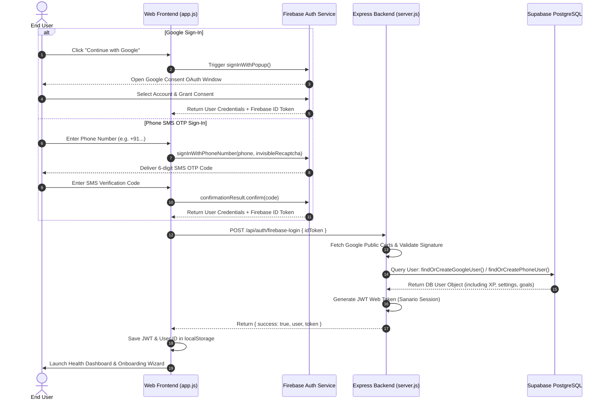

# 🌿 Sanario — A Healthy Social Media Ecosystem

Sanario is a next-generation, full-stack digital wellbeing and cognitive growth platform designed to help people use technology intentionally rather than compulsively.

Instead of maximizing screen time, digital addiction, and infinite scrolling, Sanario is engineered to maximize personal growth, physical wellness, and offline well-being.

---

## 🚀 Key Features

* **🎯 Goal-Based Personalization (Two-Tower Recommender)**: Users explicitly declare their interests (e.g. Coding, Productivity, Fitness). A native Two-Tower Machine Learning matching algorithm ranks feed items based on user interest profiles.
* **📵 Anti-Doomscroll Reels Deck**: A short-form video player featuring mindfulness loops (stretches, breathing, workspace focus). Viewing more than 3 reels triggers a digital health break, locking the player and launching a 1-minute box breathing session.
* **🛡️ Content Quality Moderation (NLP Filter)**: A backend Natural Language Processing (NLP) filter evaluates content on creation to block clickbait, spam, and toxic inputs with descriptive safety flags.
* **👟 WHO Health Companion**: Integrates step trackers, water logging widgets, and real-time behavioral risk alerts (Sedentary, Dehydration, or Sleep hygiene alerts) with action recommendations based on usage patterns.
* **💬 Conversational AI Coach**: An intent-based AI Coach router that classifies user messages (mindfulness, routing, scheduling) and triggers interface controls like Box Breathing timers.
* **🎨 Premium Visual Focus Themes**: Five curated, HSL-color-tailored themes (Nature, Productivity, Minimal, Dark Focus, and Sepia Reading) built to reduce visual stress.

---

## 📐 System Architecture

```mermaid
graph TD
  subgraph Client [Client Tier (Frontend)]
    UI["Web Browser (HTML/CSS/JS)"]
    FB_SDK["Firebase Client SDK"]
  end

  subgraph Auth [Auth Identity Tier]
    FB_Auth["Firebase Auth Service"]
    Google_ID["Google OAuth Identity Certs"]
  end

  subgraph Application [Application Server (Vercel)]
    Express["Express.js Server Engine"]
    JWT_Module["JWT Verification & Session Engine"]
    ML_Coach["Intent Router & AI Coach Engine"]
    ML_Feed["Two-Tower Recommender Engine"]
  end

  subgraph Database [Storage Tier (Supabase)]
    Pooler["Supavisor Connection Pooler (Port 6543)"]
    Postgres["PostgreSQL Database"]
  end

  %% Client interactions
  UI -->|"1. Initiates Google / Phone Auth"| FB_SDK
  FB_SDK <-->|"2. Handles Handshake / OTP SMS"| FB_Auth
  FB_Auth <-->|"3. Authenticates"| Google_ID
  FB_SDK -->|"4. Returns Firebase ID Token (JWT)"| UI
  UI -->|"5. Posts Credentials & Token"| Express

  %% Backend Verification
  Express -->|"6. Decodes Header & Key ID (kid)"| JWT_Module
  JWT_Module -->|"7. Fetches Signing Certs (HTTP Get)"| Google_ID
  JWT_Module -->|"8. Cryptographically Verifies Token Signature"| Express

  %% Database connections
  Express -->|"9. Syncs User Profile & Metadata"| Pooler
  Pooler --> Postgres
```

## 🔄 User Onboarding & Auth Workflow



---

## 🛠️ Technology Stack

* **Frontend**: HTML5, Vanilla CSS Grid & Flexbox, Javascript ES6.
* **Backend**: Node.js, Express.js.
* **Database**: Dual-engine relational SQL adapter supporting:
  * **SQLite** (Local fallback development)
  * **PostgreSQL** (Production deployment)
* **Auth**: Firebase Authentication SDK (Google Sign-In & Phone SMS OTP) + JSON Web Tokens (JWT) for secure backend session headers.
* **ML Engines**: Native, client-side/server-side numerical and lexical vector models (Two-Tower, Intent Router, Wellness Evaluator, NLP Moderator).

---

## ⚙️ Setup & Installation

### Local Development
1. Clone this repository.
2. Install dependencies:
   ```bash
   npm install
   ```
3. Copy `.env.example` to `.env` and fill in secrets (leave `DATABASE_URL` empty to automatically run the local SQLite database).
4. Run the development server:
   ```bash
   node server.js
   ```
5. Open your browser to **http://localhost:3000**.

### Run with Docker
1. Build the production image:
   ```bash
   docker build -t sanario-app .
   ```
2. Run the container:
   ```bash
   docker run -p 3000:3000 --env-file .env sanario-app
   ```

---

## 🌐 Production Deployment (Vercel)

Sanario is optimized for serverless deployment on **Vercel** connected to **Supabase** for database storage and **Firebase** for secure authentication.

### 1. Database Connection (Supabase Pooler)
Since Vercel's serverless runtime relies on an IPv4 network and new Supabase databases are IPv6-only, you **must use the Supabase Connection Pooler (Supavisor)** on port `6543`.
* Set your environment variable:
  ```text
  DATABASE_URL=postgresql://postgres.[YOUR_PROJECT_REF]:[PASSWORD]@[REGION_POOLER_HOST]:6543/postgres?pgbouncer=true
  ```
  *Ensure special characters in your password (like `@`) are URL-encoded (e.g. `@` -> `%40`).*

### 2. Environment Variables on Vercel
* `NODE_ENV=production`
* `DATABASE_URL=your_encoded_supabase_pooler_connection_string`
* `JWT_SECRET=your_secure_session_key`

### 3. Authentication (Firebase Auth)
1. Register a web app in your Firebase project.
2. Go to **Authentication > Sign-in method** and enable:
   * **Google**
   * **Phone**
3. In the Firebase Auth settings, add your Vercel domains (e.g. `sanario-platform.vercel.app`) under **Authorized domains** to enable Google popup redirects and prevent reCAPTCHA errors.
